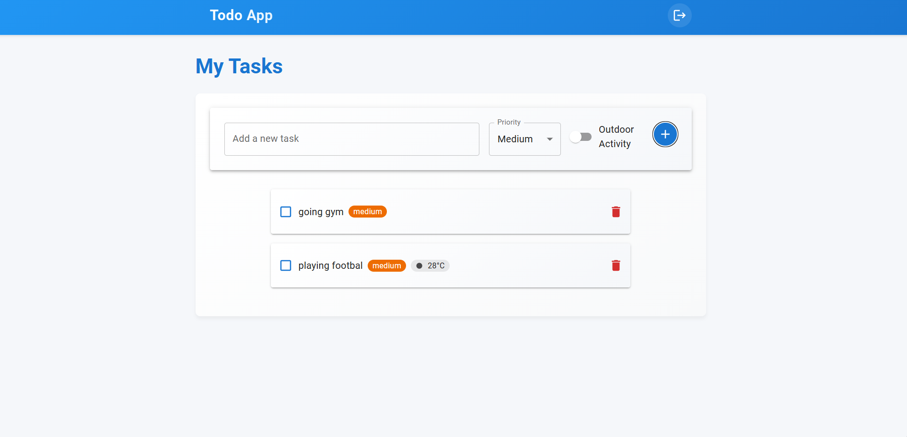

# Advanced React Todo Application

A modern, feature-rich Todo application built with React, Redux, and Material-UI. This application includes user authentication, task management with priority levels, weather integration for outdoor tasks, and a responsive design.

## Features

- 🔐 User Authentication
  - Simple username-based login
  - Protected routes
  - Persistent authentication state

- 📝 Task Management
  - Add, edit, and delete tasks
  - Mark tasks as complete/incomplete
  - Set task priority levels (Low, Medium, High)
  - Categorize tasks (Indoor/Outdoor)
  - Local storage persistence

- 🌤️ Weather Integration
  - Real-time weather information for outdoor tasks
  - Temperature and weather condition display
  - City-based weather lookup

- 🎨 Modern UI/UX
  - Clean and intuitive interface
  - Responsive design for all devices
  - Material-UI components
  - Smooth animations and transitions
  - Dark/Light theme support

## Prerequisites

- Node.js (v14 or higher)
- npm (v6 or higher)
- OpenWeatherMap API key

## Setup Instructions

1. Clone the repository:
   ```bash
   git clone https://github.com/anuj-pal27/todo-app.git
   cd todo-app
   ```

2. Install dependencies:
   ```bash
   npm install
   ```

3. Create a `.env` file in the root directory and add your OpenWeatherMap API key:
   ```
   VITE_WEATHER_API_KEY=your_api_key_here
   ```
   You can get an API key by signing up at [OpenWeatherMap](https://openweathermap.org/api)

4. Start the development server:
   ```bash
   npm run dev
   ```

5. Open your browser and navigate to `http://localhost:5173`

## Project Structure

```
todo-app/
├── src/
│   ├── components/
│   │   ├── Login.jsx
│   │   ├── TaskInput.jsx
│   │   ├── TaskList.jsx
│   │   └── TodoList.jsx
│   ├── store/
│   │   ├── index.js
│   │   └── slices/
│   │       ├── authSlice.js
│   │       └── todoSlice.js
│   ├── services/
│   │   └── weatherService.js
│   ├── App.jsx
│   └── main.jsx
├── .env
├── package.json
└── README.md
```

## Technologies Used

- React 18
- Redux Toolkit
- Material-UI
- React Router
- Vite
- OpenWeatherMap API

## Contributing

1. Fork the repository
2. Create your feature branch (`git checkout -b feature/AmazingFeature`)
3. Commit your changes (`git commit -m 'Add some AmazingFeature'`)
4. Push to the branch (`git push origin feature/AmazingFeature`)
5. Open a Pull Request

## License

This project is licensed under the MIT License - see the LICENSE file for details.

## Screenshots

### Login Page


### Todo List


### Task Input


### Weather Integration


## Acknowledgments

- [Material-UI](https://mui.com/) for the beautiful components
- [OpenWeatherMap](https://openweathermap.org/) for the weather API
- [Redux Toolkit](https://redux-toolkit.js.org/) for state management
